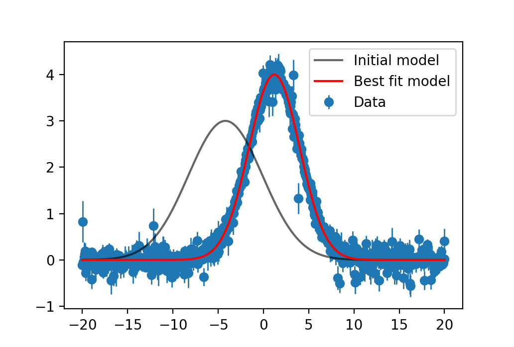

IterativeNelderMead.jl
======================

Documentation for IterativeNelderMead.jl

Details
-------

This flavor of Nelder-Mead is based on the publicly available Matlab algorithm provided [here](https://www.mathworks.com/matlabcentral/fileexchange/102-simps) with additional tweaks. It is an excellent choice for derivative-free objectives. Parameters can be passed via usual Julia vectors or a simple Dictionary-like API. Support for parameter bounds is provided, but any constraints must be manually implemented through the objective function.

Looking Forward
---------------
The goal for IterativeNelderMead.jl is to be included in the standard SciML package 


Examples
--------

#### Example 1: Curve fitting with vectors API

```julia
# Imports
using IterativeNelderMead
using PyPlot

# Build a Gaussian function
function gauss(x, a, μ, σ)
    return @. a * exp(-0.5 * ((x - μ) / σ)^2)
end

# Create a noisy toy dataset
x = [-20:0.05:20;]
ptrue = [4.0, 1.2, 2.8]
ytrue = gauss(x, ptrue...)
yerr = abs.(0.1 .+ 0.1 .* randn(size(ytrue)))
ytrue .+= yerr .* randn(size(ytrue))

# Chi2 loss function
redχ2loss(residuals, yerr, ν) = sum((residuals ./ yerr).^2) / ν
loss(pars) = redχ2loss(ytrue .- gauss(x, pars...), yerr, length(ytrue) .- length(pars))

# Initial parameters and model
p0 = [3.0, -4.2, -4.1]
lower_bounds = [0, -Inf, 0]
upper_bounds = [Inf, Inf, Inf]
y0 = gauss(x, p0...)

# Optimize
result = optimize(loss, p0, IterativeNelderMeadOptimizer())

# Best fit model
ybest = gauss(x, result.pbest...)

# Plot
begin
    errorbar(x, ytrue, yerr=yerr, marker="o", lw=0, elinewidth=1, label="Data", zorder=0)
    plot(x, y0, c="black", label="Initial model", alpha=0.6)
    plot(x, ybest, c="red", label="Best fit model")
    legend()
    plt.show()
end
```


#### Example 2: Curve fitting with Parameters API

```julia
# Imports
using IterativeNelderMead
using PyPlot

# Build a Gaussian function 
function gauss(x, pars)
    a = pars["a"].value
    μ = pars["μ"].value
    σ = pars["σ"].value
    return @. a * exp(-0.5 * ((x - μ) / σ)^2)
end

# Create a noisy toy dataset
x = [-20:0.05:20;]
ptrue = Parameters()
ptrue["a"] = Parameter(value=4.0)
ptrue["μ"] = Parameter(value=1.2)
ptrue["σ"] = Parameter(value=2.8)
ytrue = gauss(x, ptrue)
yerr = abs.(0.1 .+ 0.1 .* randn(size(ytrue)))
ytrue .+= yerr .* randn(size(ytrue))

# Chi2 loss function
redχ2loss(residuals, yerr, ν) = sum((residuals ./ yerr).^2) / ν
loss(pars) = redχ2loss(ytrue .- gauss(x, pars), yerr, length(ytrue) .- length(pars))

# Initial parameters and model
p0 = Parameters()
p0["a"] = Parameter(value=3.0, lower_bound=0, upper_bound=Inf)
p0["μ"] = Parameter(value=-4.2)
p0["σ"] = Parameter(value=4.1, lower_bound=0, upper_bound=Inf)
y0 = gauss(x, p0)

result = optimize(loss, p0, IterativeNelderMeadOptimizer())
ybest = gauss(x, result.pbest)

begin
    errorbar(x, ytrue, yerr=yerr, marker="o", lw=0, elinewidth=1, label="Data", zorder=0)
    plot(x, y0, c="black", label="Initial model", alpha=0.6)
    plot(x, ybest, c="red", label="Best fit model")
    legend()
    plt.show()
end
```

The resulting plot is shown below.



API
---

```@docs
IterativeNelderMeadOptimizer
```

```@docs
optimize
```

```@docs
Parameter
Parameters
```